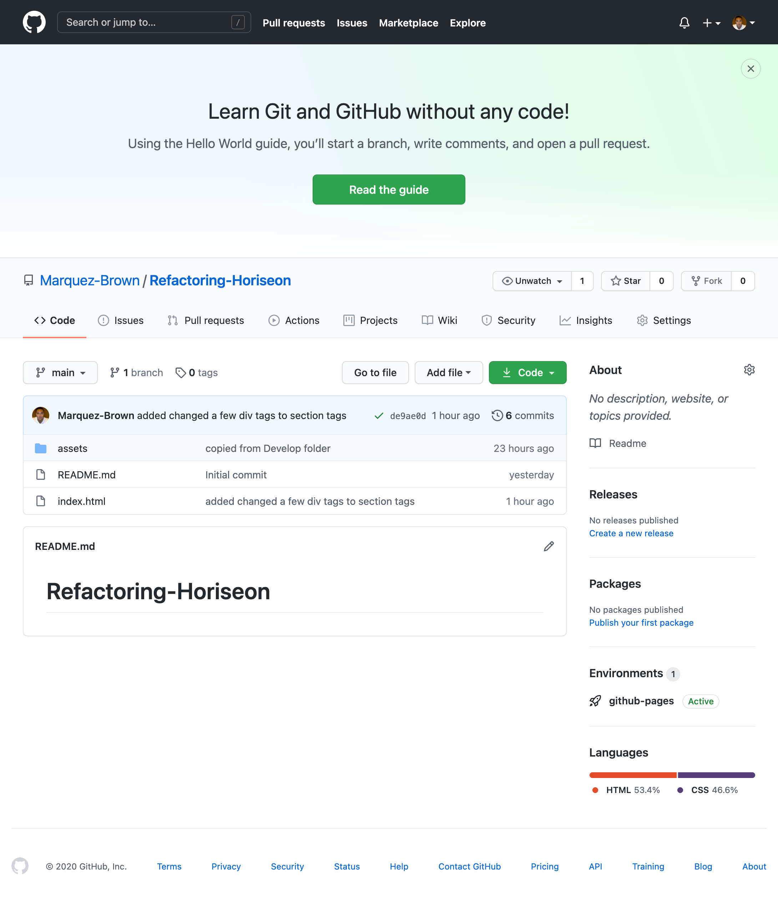

# ***Horiseon Readme***

## Purpose

This repository is being used to develop the Horiseon website.
We are working on refactoring and making the website more streamlined and well as implementing best coding practices.  There was a lack of semantic html within the index file that we changed to more accessible tags.  Some of the challenges faced were keeping the layout and functionality of the website exactly the same.

Link of working product
https://marquez-brown.github.io/Refactoring-Horiseon/
Link to Github Repository
https://github.com/Marquez-Brown/Refactoring-Horiseon

## Usage

- List Install a code editor such as Sublime text, Atomic text editor, or Visual Studio.
- Download the Github repository at https://github.com/Marquez-Brown/Refactoring-Horiseon
- Edit the files as you see fit in the code editor of your choice.  
- You may also view the code in the chrome dev tools if using the chrome browser.

## Recent changes

12-2-2020
 Added comments to break down the sections of the website.  Replaced alot of div tags with semantic html tags instead within index.html.  Consolidated some of the .classes in style.css.
12-3-2020
Updated READ.ME

<!--  -->

## If you would like to contribute

To help with refactoring the code, please ask for a clone of the repo, make the changes along with comments and for overview and permission to push.

## License

MIT License

Copyright (c) [2020] [Horiseon inc.]

Permission is hereby granted, free of charge, to any person obtaining a copy
of this software and associated documentation files (the "Software"), to deal
in the Software without restriction, including without limitation the rights
to use, copy, modify, merge, publish, distribute, sublicense, and/or sell
copies of the Software, and to permit persons to whom the Software is
furnished to do so, subject to the following conditions:

The above copyright notice and this permission notice shall be included in all
copies or substantial portions of the Software.

THE SOFTWARE IS PROVIDED "AS IS", WITHOUT WARRANTY OF ANY KIND, EXPRESS OR
IMPLIED, INCLUDING BUT NOT LIMITED TO THE WARRANTIES OF MERCHANTABILITY,
FITNESS FOR A PARTICULAR PURPOSE AND NONINFRINGEMENT. IN NO EVENT SHALL THE
AUTHORS OR COPYRIGHT HOLDERS BE LIABLE FOR ANY CLAIM, DAMAGES OR OTHER
LIABILITY, WHETHER IN AN ACTION OF CONTRACT, TORT OR OTHERWISE, ARISING FROM,
OUT OF OR IN CONNECTION WITH THE SOFTWARE OR THE USE OR OTHER DEALINGS IN THE
SOFTWARE.
